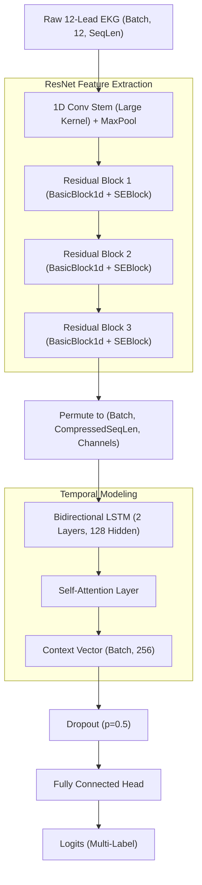

# Architecture Overview

This document serves as the technical reference for the ArrhythmiaClassifier codebase. It details the PyTorch architecture, data ingestion strategies, loss computation, and Databricks integration workflows.

## System Overview
The ArrhythmiaClassifier is a clinical-grade EKG Multi-Label classification system designed to predict various cardiac arrhythmias from raw waveform data. The system is built to handle variable-length sequences from standard 12-lead EKGs, transforming high-frequency clinical data into predictive diagnostic labels.

## Model Architecture (`WFDBResNetLSTM`)

The core model architecture is a Convolutional Recurrent Neural Network (CRNN) that combines a 1D ResNet for spatial feature extraction with a Bidirectional LSTM for temporal sequence modeling, capped with a self-attention mechanism for temporal pooling.

### 1. Convolutional Stem
Because clinical EKG data is sampled at high frequencies (e.g., 500Hz), the raw signal length is very large. We use an initial 1D convolutional stem with a large kernel size (`kernel_size=15`) and a high stride (`stride=3`) combined with Max Pooling to aggressively downsample the spatial sequence dimension while extracting initial low-level waveform features.

### 2. Residual Blocks with Squeeze-and-Excitation (SE)
The network relies on three layers of 1D Residual Blocks (`BasicBlock1d`). These blocks prevent the vanishing gradient problem and allow deep feature extraction. Inside each block, we utilize a **Squeeze-and-Excitation (`SEBlock`)** mechanism. The SE block dynamically recalibrates channel-wise feature responses by explicitly modeling interdependencies between channels. In the context of a 12-lead EKG, this effectively allows the network to dynamically "pay more attention" to certain leads (e.g., Lead II or V1) if they contain stronger signs of a specific arrhythmia.

### 3. Sequence Modeling (LSTM)
The compressed feature maps output by the ResNet are sequence data. We feed these into a 2-layer Bidirectional LSTM. This allows the network to capture complex temporal dependencies and sequential patterns across the entire duration of the EKG recording, processing information both forwards and backwards in time.

### 4. Self-Attention Pooling
Instead of naively taking the final hidden state of the LSTM or using Global Average Pooling on the temporal dimension, we apply a learned **Self-Attention** layer. This layer learns to weigh different time steps of the LSTM output, squashing the temporal sequence into a single, fixed-size context vector. 
* **Key Benefit**: This makes the network invariant to the exact length of the input EKG. It can process a 10-second strip or a 60-second strip dynamically, automatically focusing its attention on the specific segments of the sequence where the arrhythmia actually occurs.

## Data Ingestion (`WFDBDataset`)
Raw `.mat` waveform files and their corresponding `.hea` header files are lazily loaded. The dataset seamlessly handles missing leads, applies dynamic padding via `pad_collate` to batch variable-length sequences together, and transforms the signals into standard `(12, sequence_length)` PyTorch tensors.

## Loss Function (`FocalLoss`)
Clinical datasets are inherently imbalanced; normal sinus rhythms dominate the dataset, while critical life-threatening arrhythmias are exceptionally rare. We employ **Focal Loss** to address this extreme class imbalance. Focal loss dynamically scales the standard Cross-Entropy loss based on prediction confidence, down-weighting well-classified dominant classes and heavily penalizing misclassifications on hard, rare examples.

## MLflow & Databricks Integrations
The model lifecycle is entirely managed via MLflow and Databricks.

* **Safe Serialization**: Models are saved using the modern PyTorch `pt2` serialization format. This format relies on PyTorch's newer `torch.export` graph tracing mechanism, preventing arbitrary code execution risks present in older `Pickle` formats.
* **Dependencies**: We explicitly log environment requirements to prevent inference environments from inferring incorrect Pip packages.
* **Databricks Prediction Notebook**: `databricks_predict.py` operates directly against Unity Catalog Delta tables. It pulls the production-tagged model from the MLflow Model Registry and processes data in parallel using PySpark UDFs for scalable inference.
* **Fine-Tuning Workflow**: Retraining and transferring knowledge is handled in the `finetune_databricks.py` notebook. This notebook isolates the classification head and freezes the feature extraction layers, making it ideal for adapting to new, local hospital datasets stored within a Databricks environment.

